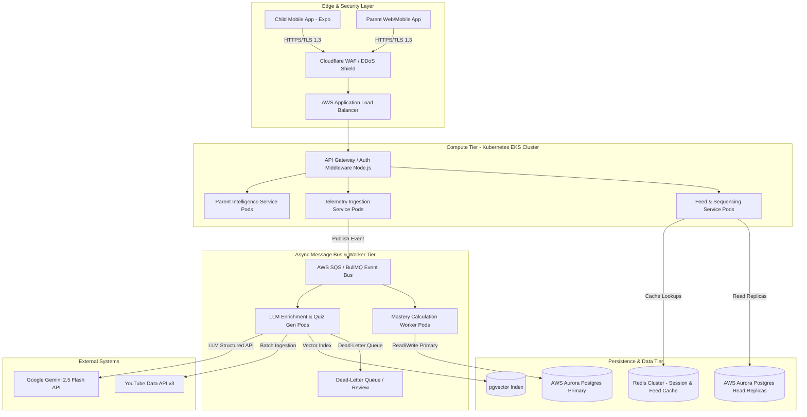
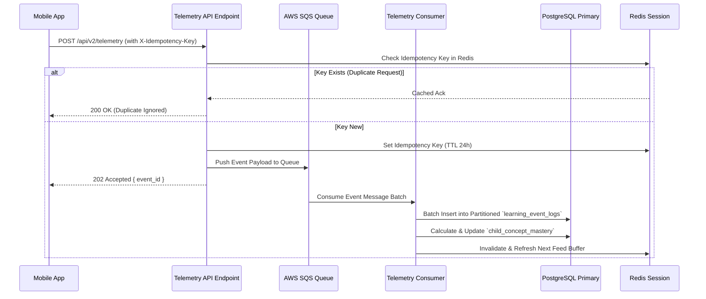
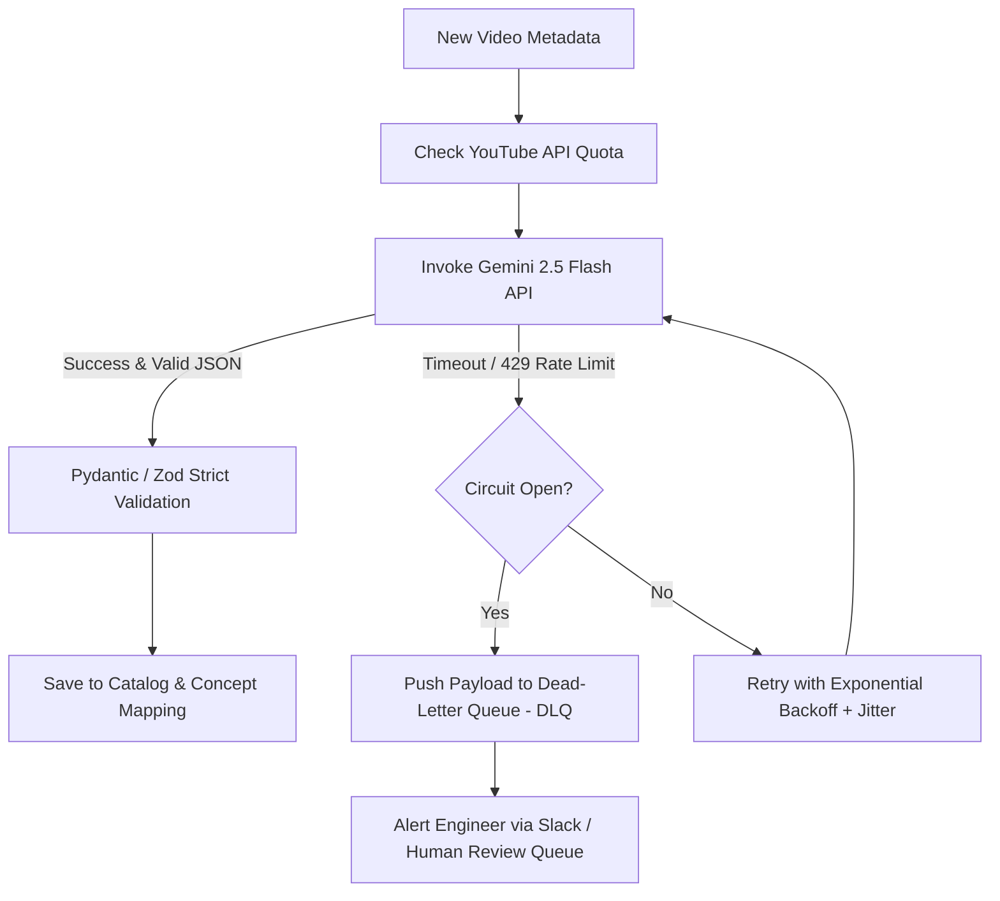
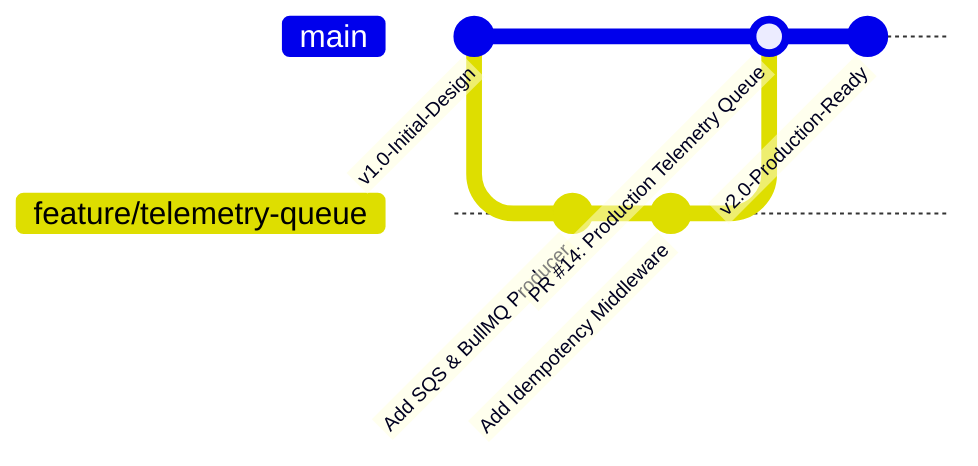

# Production-Grade Technical Design Document: FlickEd Platform

**Document Version:** 2.0 (Production-Grade)  
**Date:** August 13, 2026  
**Status:** Approved Architecture & Specification  
**Target Product:** FlickEd (Flick. Learn. Unlock.)  
**PRD Reference:** [FlickEd MVP PRD v4.0](file:///Users/neetishtewari/Projects/flickEd/FlickEd%20MVP%20Product%20Requirements%20Document.md)

---

## 1. Executive Summary & Production Readiness Assessment

FlickEd is an enterprise-grade learning orchestration platform that transforms short-form video supply (YouTube) into outcome-driven, sequential learning journeys for children aged 8–12.

### Is the Design Production-Grade?

Version 1.0 established the functional core (Graph DAG, recommendation scoring, active recall). **Version 2.0 elevates this architecture to enterprise production grade** by implementing:

* **High Availability (HA) & Multi-AZ Infrastructure:** Active-Active API tier behind Cloudflare WAF and AWS ALB, PostgreSQL Multi-AZ with Read Replicas, and Redis Cluster.
* **Event-Driven Asynchronous Pipeline:** Message queues (AWS SQS / BullMQ) decoupling telemetry ingestion, mastery updates, and LLM background workers from the main HTTP thread.
* **High-Throughput Partitioned Storage:** Table partitioning by range (monthly) for telemetry event logs handling $>10,000$ events/sec.
* **Zero-Trust Security & COPPA Compliance:** PostgreSQL Row-Level Security (RLS), JWT access token rotation with hardware SecureStore on mobile, and strict Parent PIN authentication.
* **Resilience Patterns:** Idempotency keys (`X-Idempotency-Key`), Circuit Breakers on external APIs, and Dead-Letter Queues (DLQ) for ingestion/LLM processing failures.
* **Full Observability:** OpenTelemetry distributed tracing, Prometheus instrumentation ($p_{99} < 100\text{ms}$ goal), and Grafana alerts for YouTube API quota consumption.

---

## 2. Enterprise System Architecture Topology

The production infrastructure separates stateless API application nodes from asynchronous event consumers and dedicated storage clusters.



---

## 3. Core Architectural Subsystems & Engineering Specifications

---

### 3.1 Asynchronous Telemetry & Event Ingestion Pipeline

To prevent HTTP request blocking when millions of telemetry events (video progress, scroll events, active recall answers) are submitted, FlickEd employs an asynchronous queue worker pattern.



---

### 3.2 Production PostgreSQL Database Schema (Partitions, Triggers & RLS)

Below is the production DDL script featuring table partitioning for telemetry, PostgreSQL Row-Level Security (RLS) for tenant isolation, soft deletes, and index optimizations.

```sql
-- Extensions
CREATE EXTENSION IF NOT EXISTS "uuid-ossp";
CREATE EXTENSION IF NOT EXISTS "vector";
CREATE EXTENSION IF NOT EXISTS "pg_stat_statements";

-- Enums
CREATE TYPE user_role AS ENUM ('PARENT', 'ADMIN');
CREATE TYPE difficulty_level AS ENUM ('BEGINNER', 'INTERMEDIATE', 'ADVANCED');
CREATE TYPE question_type AS ENUM ('MULTIPLE_CHOICE', 'TRUE_FALSE', 'PREDICTION');
CREATE TYPE journey_status AS ENUM ('IN_PROGRESS', 'COMPLETED', 'PAUSED');

-- 1. Users Table (Parents)
CREATE TABLE users (
    id UUID PRIMARY KEY DEFAULT gen_random_uuid(),
    email VARCHAR(255) UNIQUE NOT NULL,
    password_hash VARCHAR(255) NOT NULL,
    full_name VARCHAR(255) NOT NULL,
    parent_pin_hash VARCHAR(255) NOT NULL,
    role user_role DEFAULT 'PARENT',
    is_email_verified BOOLEAN DEFAULT FALSE,
    deleted_at TIMESTAMPTZ DEFAULT NULL, -- Soft Delete
    created_at TIMESTAMPTZ DEFAULT CURRENT_TIMESTAMP,
    updated_at TIMESTAMPTZ DEFAULT CURRENT_TIMESTAMP
);

-- 2. Child Profiles Table
CREATE TABLE child_profiles (
    id UUID PRIMARY KEY DEFAULT gen_random_uuid(),
    parent_id UUID NOT NULL REFERENCES users(id) ON DELETE CASCADE,
    first_name VARCHAR(100) NOT NULL,
    age INT NOT NULL CHECK (age BETWEEN 5 AND 17),
    grade_level INT NOT NULL CHECK (grade_level BETWEEN 0 AND 12),
    avatar_id VARCHAR(50) DEFAULT 'default_avatar',
    interests TEXT[] DEFAULT '{}',
    xp_points INT DEFAULT 0,
    current_streak_days INT DEFAULT 0,
    last_active_at TIMESTAMPTZ,
    deleted_at TIMESTAMPTZ DEFAULT NULL,
    created_at TIMESTAMPTZ DEFAULT CURRENT_TIMESTAMP,
    updated_at TIMESTAMPTZ DEFAULT CURRENT_TIMESTAMP
);

-- Enable Row Level Security (RLS) for Tenant Isolation
ALTER TABLE child_profiles ENABLE ROW LEVEL SECURITY;

CREATE POLICY child_profile_parent_isolation ON child_profiles
    FOR ALL
    USING (parent_id = current_setting('app.current_parent_id')::UUID);

-- 3. Concepts Table (Learning Graph Nodes)
CREATE TABLE concepts (
    id UUID PRIMARY KEY DEFAULT gen_random_uuid(),
    code VARCHAR(50) UNIQUE NOT NULL,
    subject VARCHAR(100) NOT NULL,
    topic VARCHAR(100) NOT NULL,
    subtopic VARCHAR(100),
    title VARCHAR(255) NOT NULL,
    description TEXT,
    target_grade_min INT NOT NULL,
    target_grade_max INT NOT NULL,
    embedding vector(1536),
    created_at TIMESTAMPTZ DEFAULT CURRENT_TIMESTAMP
);

-- 4. Concept Prerequisites Table (Learning Graph DAG)
CREATE TABLE concept_prerequisites (
    parent_concept_id UUID NOT NULL REFERENCES concepts(id) ON DELETE CASCADE,
    child_concept_id UUID NOT NULL REFERENCES concepts(id) ON DELETE CASCADE,
    PRIMARY KEY (parent_concept_id, child_concept_id),
    CONSTRAINT no_self_loop CHECK (parent_concept_id <> child_concept_id)
);

-- 5. Video Catalog Table
CREATE TABLE video_catalog (
    id UUID PRIMARY KEY DEFAULT gen_random_uuid(),
    youtube_video_id VARCHAR(20) UNIQUE NOT NULL,
    title VARCHAR(255) NOT NULL,
    channel_name VARCHAR(150) NOT NULL,
    channel_id VARCHAR(100) NOT NULL,
    duration_seconds INT NOT NULL,
    thumbnail_url TEXT NOT NULL,
    safety_score NUMERIC(3, 2) CHECK (safety_score BETWEEN 0 AND 10),
    quality_score NUMERIC(3, 2) CHECK (quality_score BETWEEN 0 AND 10),
    is_approved BOOLEAN DEFAULT FALSE,
    raw_transcript TEXT,
    created_at TIMESTAMPTZ DEFAULT CURRENT_TIMESTAMP
);

-- 6. Video Questions Table
CREATE TABLE video_questions (
    id UUID PRIMARY KEY DEFAULT gen_random_uuid(),
    video_id UUID NOT NULL REFERENCES video_catalog(id) ON DELETE CASCADE,
    concept_id UUID NOT NULL REFERENCES concepts(id) ON DELETE CASCADE,
    trigger_time_seconds INT DEFAULT 0,
    question_type question_type DEFAULT 'MULTIPLE_CHOICE',
    question_text TEXT NOT NULL,
    options JSONB NOT NULL,
    correct_option_index INT NOT NULL,
    explanation TEXT,
    created_at TIMESTAMPTZ DEFAULT CURRENT_TIMESTAMP
);

-- 7. Partitioned Telemetry Event Logs Table (Range Partitioned by Month)
CREATE TABLE learning_event_logs (
    id UUID DEFAULT gen_random_uuid(),
    child_id UUID NOT NULL REFERENCES child_profiles(id) ON DELETE CASCADE,
    video_id UUID REFERENCES video_catalog(id),
    question_id UUID REFERENCES video_questions(id),
    event_type VARCHAR(50) NOT NULL,
    watch_time_seconds INT DEFAULT 0,
    user_answer_index INT,
    is_correct BOOLEAN,
    idempotency_key VARCHAR(128),
    created_at TIMESTAMPTZ NOT NULL DEFAULT CURRENT_TIMESTAMP,
    PRIMARY KEY (id, created_at)
) PARTITION BY RANGE (created_at);

-- Partition Tables for 2026
CREATE TABLE learning_event_logs_2026_08 PARTITION OF learning_event_logs
    FOR VALUES FROM ('2026-08-01 00:00:00+00') TO ('2026-09-01 00:00:00+00');

CREATE TABLE learning_event_logs_2026_09 PARTITION OF learning_event_logs
    FOR VALUES FROM ('2026-09-01 00:00:00+00') TO ('2026-10-01 00:00:00+00');

-- High Performance Indexes
CREATE INDEX idx_concepts_subject_topic ON concepts(subject, topic);
CREATE INDEX idx_video_catalog_approved ON video_catalog(is_approved, safety_score) WHERE is_approved = TRUE;
CREATE INDEX idx_event_logs_child_time ON learning_event_logs(child_id, created_at DESC);
CREATE INDEX idx_event_logs_idempotency ON learning_event_logs(idempotency_key) WHERE idempotency_key IS NOT NULL;
CREATE INDEX idx_concepts_hnsw ON concepts USING hnsw (embedding vector_cosine_ops);
```

---

## 4. Resilience, Security & Operational Patterns

### 4.1 Resilient LLM Ingestion & Circuit Breakers
To prevent downstream API timeouts or LLM quota exhaustion from failing the pipeline, the LLM enrichment worker implements a **Circuit Breaker pattern** (using Resilience4j / Cockatiel) with exponential backoff and jitter.



### 4.2 Auth & Token Lifecycle
1. **Parent Authentication:** Issues a short-lived **JWT Access Token (TTL 15 min)** and a long-lived **Refresh Token (TTL 30 days)** stored in `HttpOnly`, `SameSite=Strict`, `Secure` cookies (Web) or iOS Keychain / Android KeyStore (Mobile).
2. **Child Session Token:** Generated upon Parent PIN verification. Scoped strictly to read/write access for `child_id` with strict PostgreSQL Row-Level Security (`app.current_parent_id`).

### 4.3 Rate Limiting Tiering
* **Public APIs:** 60 requests/minute per IP (Redis Sliding Window).
* **Child Telemetry API:** 300 requests/minute per authenticated `child_id` (token bucket).
* **Parent Intelligence API:** 60 requests/minute per parent session.

---

## 5. Observability & Telemetry Framework

A production deployment requires full observability to guarantee performance SLAs ($p_{99} < 100\text{ms}$ for feed API) and track system health.

### Key Performance Indicators (Prometheus Metrics)

```typescript
import { Counter, Histogram } from 'prom-client';

// 1. Feed Latency Histogram
export const feedGenerationDuration = new Histogram({
  name: 'flicked_feed_generation_duration_seconds',
  help: 'Duration of feed recommendation API requests in seconds',
  labelNames: ['status_code', 'subject'],
  buckets: [0.05, 0.1, 0.25, 0.5, 1.0, 2.5]
});

// 2. Telemetry Ingestion Counter
export const telemetryEventsCounter = new Counter({
  name: 'flicked_telemetry_events_total',
  help: 'Total count of telemetry events ingested',
  labelNames: ['event_type', 'is_correct']
});

// 3. YouTube Quota Consumption Counter
export const youtubeQuotaConsumption = new Counter({
  name: 'flicked_youtube_api_quota_units_consumed',
  help: 'Cumulative YouTube Data API quota units spent',
  labelNames: ['endpoint']
});
```

### Alert Threshold Matrix

| Alert Metric | Condition | Severity | Notification Channel |
| :--- | :--- | :--- | :--- |
| **Feed Generation Latency** | $p_{99} > 500\text{ms}$ for 5 mins | P1 Critical | PagerDuty / On-Call Engineer |
| **YouTube Quota Consumption** | Usage $> 8,000$ units (80% of daily limit) | P2 High | Slack `#devops-alerts` |
| **DLQ Message Spikes** | $> 50$ failed LLM jobs in 15 mins | P2 High | Slack `#ai-pipeline-alerts` |
| **Database Pool Exhaustion** | Connection utilization $> 85\%$ | P1 Critical | PagerDuty |

---

## 6. Production CI/CD & Deployment Matrix



### Zero-Downtime Migration Strategy
1. **Schema Migrations:** Managed via `golang-migrate` or `Prisma Migrate` in CI/CD pipeline.
2. **Backward Compatibility:** All DDL changes use two-phase deployment (e.g. Add column $\rightarrow$ Deploy application code $\rightarrow$ Deprecate old column).
3. **Blue/Green Deployment:** AWS EKS rolling updates with readiness/liveness probes (`/healthz` endpoint checking PostgreSQL and Redis connectivity).

---

## 7. Technical Risk & Production Mitigation Summary

| Production Domain | Production Risk | Technical Mitigation Strategy |
| :--- | :--- | :--- |
| **Data Growth** | Telemetry table grows by millions of rows/month causing query slowdowns. | Range partitioning by month on `learning_event_logs` with automated partition pruning and cold storage archiving to AWS S3 / Athena. |
| **Duplicate Submissions** | Network retries double-count XP or trigger multiple mastery updates. | Mandatory `X-Idempotency-Key` header verified against Redis with a 24-hour TTL before processing. |
| **LLM Outages / Rate Limits** | Gemini API outage halts video enrichment pipeline. | Circuit Breaker triggers fallback to pre-verified seed catalog and queues failed jobs into an SQS Dead-Letter Queue (DLQ). |
| **Tenant Cross-Contamination** | Child A accesses or mutates Child B's learning progress. | PostgreSQL Row-Level Security (RLS) policies enforced at the database layer using session variables (`app.current_parent_id`). |
