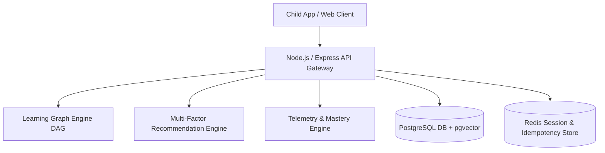

# FlickEd — Flick. Learn. Unlock.

**FlickEd** transforms passive short-form video consumption into structured, outcome-driven learning journeys for children aged 8–12.

> **"The learning layer for the videos your child already watches."**

---

## 🌟 Core Product Vision

Parents use platforms like YouTube as educational resources, but face choice overload, variable quality, and lack of structure. FlickEd provides the missing **Learning Layer**:

1. **Child Profile & Interest Graph:** Maps child age, grade level, and interests.
2. **Concept / Learning Graph:** Directed Acyclic Graph (DAG) mapping prerequisites across subjects (e.g. Fractions, Astronomy).
3. **Sequential Video Feed:** Generates a structured sequence of short-form educational videos using a multi-factor recommendation engine.
4. **Active Learning Checkpoints:** Interleaves lightweight active recall questions into videos to validate understanding.
5. **Parent Intelligence Portal:** Provides clear concept-level mastery metrics and AI-generated parent-child conversation starters.

---

## 🏗️ Architecture & Technical Specs

FlickEd is engineered to enterprise production-grade standards:

* **Production Spec:** [FlickEd MVP Technical Design Document (v2.0)](./FlickEd%20MVP%20Technical%20Design%20Document.md)
* **PRD:** [FlickEd MVP Product Requirements Document](./FlickEd%20MVP%20Product%20Requirements%20Document.md)



---

## 🚀 Getting Started

### Prerequisites
* Node.js v18+ & npm
* Docker & Docker Compose (Optional for local Postgres + Redis)

### Running the Web Prototype & App
```bash
# Start local web preview
python3 -m http.server 8080
# Open http://localhost:8080 in your browser
```

### Running the Backend API
```bash
cd backend
npm install
npm run dev
# Server running at http://localhost:4000
```

### Running Database Migrations & Seeding (PostgreSQL)
```bash
# Start local postgres & redis via docker
docker compose up -d

# Run migrations and seed data
cd backend
npm run db:migrate
npm run db:seed
```

---

## 📊 Database Schema Summary

* `users` & `child_profiles`: Parent authentication & child tenant metadata.
* `concepts` & `concept_prerequisites`: Graph nodes and prerequisite DAG dependency edges.
* `video_catalog`, `video_concept_mappings`, `video_questions`: Pre-ingested YouTube videos from trusted creator allowlists enriched with active recall questions.
* `child_concept_mastery` & `learning_event_logs`: Concept progress telemetry (range-partitioned by month).

---

## 📄 License
ISC / Proprietary — All Rights Reserved.
